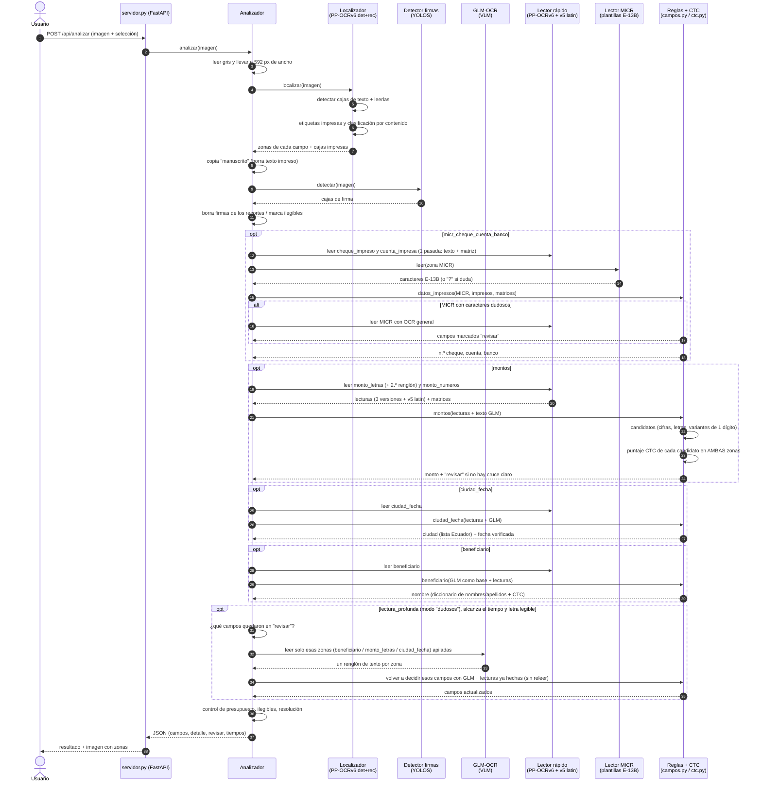

# Arquitectura de la PoC de lectura de cheques

Resumen de qué se usa y cómo interactúan las piezas al analizar el anverso de un cheque.
Todo corre en **un solo proceso local en CPU**: no usa nube ni servicios externos.

## Qué se usa

| Pieza | Tecnología | Para qué | Tiempo aprox.* |
|---|---|---|---|
| Interfaz y API | FastAPI + uvicorn (`servidor.py`, `static/`) | Subir un cheque o una carpeta, ver resultados, Excel | — |
| Orquestador | `poc/analizador.py` | Ejecuta los pasos, controla el presupuesto de tiempo, arma el JSON | — |
| Localizador de campos | **PP-OCRv6 detección "small" + reconocimiento** (RapidOCR / ONNX) — `poc/localizador.py` | Encuentra todas las cajas de texto, reconoce las etiquetas impresas ("Páguese a", "La suma de", "US$"...) y calcula la zona de cada campo | ~4,5–9 s |
| Clasificador por contenido | Reglas en Python — `poc/clasificador.py` | Reubica campos según lo que dicen (fecha, palabras de número, nombres) | <0,1 s |
| Detector de firmas | **YOLOS-tiny** (transformers / torch) — `externos/firmas/` | Borra la firma de los recortes; si una "firma" tapa 2+ campos, marca la letra como ilegible | ~1,5 s |
| Lectura profunda | **GLM-OCR 0,9 B** (VLM, transformers / torch) — `poc/profundo.py` | Lee la letra manuscrita en UNA pasada con las tiras apiladas. Con `lectura_profunda_modo: "dudosos"` (por omisión) solo lee las zonas que el camino rápido dejó en revisión; `"siempre"` las lee todas antes | ~35 s (lo más caro) |
| Lector rápido | **PP-OCRv6 small** reconocimiento (ONNX) — `poc/lector.py` | Lee cada zona en 3 versiones (limpia x3, gris x3, limpia x2) y da la matriz de probabilidades | ~0,5 s por zona |
| Lector secundario | **PP-OCRv5 latin** (ONNX) | Otra opinión en zonas manuscritas (suma candidatos) | ~0,2 s por zona |
| Lector MICR | Plantillas E-13B con OpenCV — `poc/micr.py` | Lee la banda MICR (cheque, ruta, cuenta) carácter por carácter | milisegundos |
| Verificador CTC | Viterbi sobre la matriz de PP-OCR — `poc/ctc.py` | Puntúa cada candidato ("cuatrocientos setenta y cinco") **contra la imagen** | ~1 s en total |
| Reglas por campo | `poc/campos.py`, `parsers.py`, `reglas.py`, `nombres.py` | Genera candidatos, cruza cifras con letras, valida fechas, ciudades y nombres; decide OK o REVISAR | <0,5 s |
| Lotes | `poc/lotes.py` + openpyxl | Carpeta en segundo plano, acierto vs `verdad.csv`, Excel en `resultados/` | — |

\* Medido el 2026-10-08 con `muestras/pichincha_0001.tif` en una PC de 3 núcleos. Total: ~50 s por cheque. Sin GLM: ~10 s.

**Idea central:** ningún OCR se acepta "porque sí".
1. GLM, PP-OCR y el segundo lector solo **proponen** candidatos.
2. El verificador CTC mide qué tan bien encaja cada candidato con los trazos.
3. Las reglas cruzan fuentes: cifras con letras, MICR con lo impreso.
4. Un campo solo sale automático si gana con margen. Si no, queda en `revisar`.

## Diagrama de secuencia (un cheque)

## Notas

- **Arranque:** al levantar se cargan todos los modelos y se analiza el cheque de referencia
  (`plantillas/`) como calentamiento. Por eso tarda 1,5–3,5 min.
- **Presupuesto de tiempo:** `config.json` → `presupuesto_segundos_por_lado`. Si un paso no
  alcanza, sus campos quedan "omitido / revisar" en lugar de pasarse del límite.
- **Selección:** `config.json` → `anverso` activa o desactiva cada grupo de campos.
  `lectura_profunda` activa GLM.
- **Lotes:** `POST /api/lotes` procesa una carpeta con el mismo motor que el análisis individual y genera
  el Excel (en el orden de la carpeta). Con 1 proceso, de a un cheque (candado); con N, N a la vez.
- **Ejecución** (`poc/hardware.py`, `poc/arranque.py`, `poc/paralelo.py`): al levantar se detecta CPU, RAM y
  GPU, se pregunta CPU/GPU y n.º de procesos. 1 proceso = `MotorLocal` (el modo original). N procesos =
  `PoolProcesos`: N procesos `spawn`, cada uno con su `Analizador`, sus hilos (núcleos / N) y su GPU
  (por turnos); cada pedido va al primer proceso libre.

## Pendientes de optimización

- **GLM en segundo plano** (devolver primero el resultado rápido). Hecho: GLM solo para campos dudosos (`lectura_profunda_modo`).
- **GLM en int8** (`quantize_dynamic` u OpenVINO): las capas lineales son ~60 % de su tiempo.
- **Calentamiento corto al arrancar:** una imagen chica para GLM en lugar del análisis completo.
- **Descartados:**
  - Detector "tiny" o entrada más chica en el localizador: mueve las zonas.
  - Tiras de GLM de alto 40 o 32, o relleno ajustado al ancho: empeora la lectura manuscrita.
